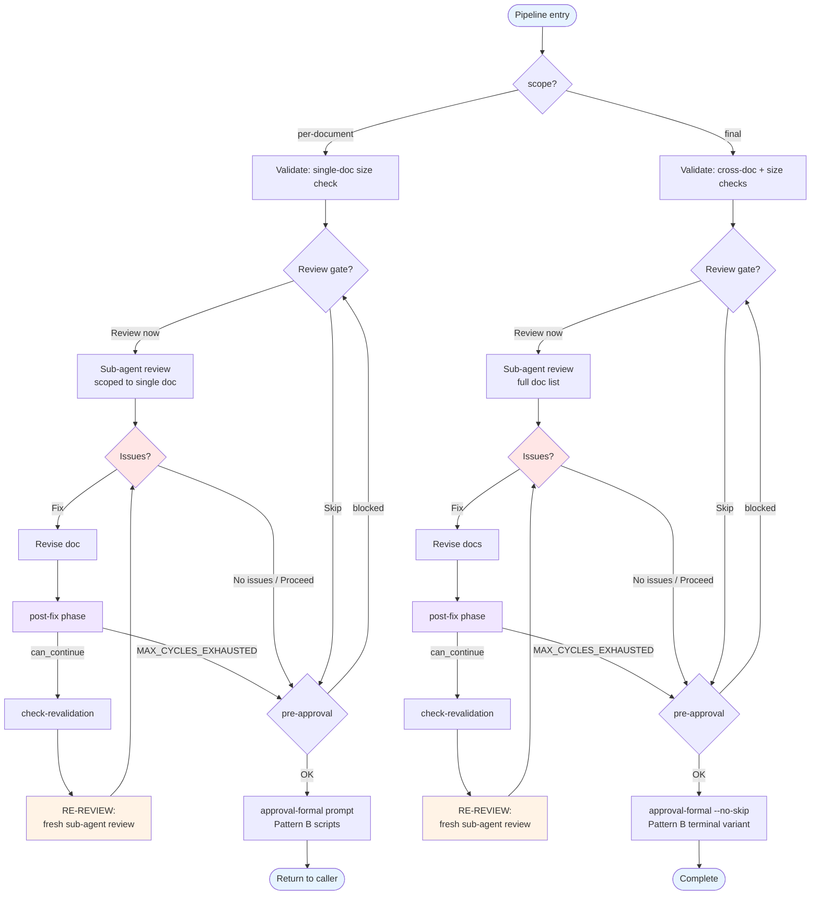

# Review and Approval Pipeline

Shared pipeline used at every approval point in creation workflows. Supports
both per-document and final (cross-document) approval via a single scope-aware
design.

## Harness assumptions

This pipeline supports multiple agent harnesses (Cursor, standard Claude
Code, Claude Code Task variants, and any future host that plugs in via a
`HarnessAdapter`). Harness capabilities are detected by
`sdd-common/scripts/util/probe-harness.py` and persisted to
`.spec-workflow/.sdd-state/harness.json`. Every call site that emits
TODO payloads, AskQuestion prompts, or sub-agent dispatch hints reads
those capabilities through `sdd_core.harness.loader.load_adapter()`;
this document is harness-agnostic beyond the adapter naming.
Escape hatch: set `SDD_HARNESS_OVERRIDE=<name>` when deploying in an
unusual host.

## Contents

- [Scope Parameter](#scope-parameter)
- [Pipeline Steps](#pipeline-steps)
- [Pipeline Diagram](#pipeline-diagram)
- [Phase Reference](#phase-reference)
  - [Transitions](#transitions)
  - [Phase catalog](#phase-catalog)
  - [Action kinds](#action-kinds)
  - [Registry parity](#registry-parity)
- [Caller Contract](#caller-contract)
- [Validation Behavior by Scope](#validation-behavior-by-scope)
- [Review Gate](#review-gate)
  - [Review Gate Parameters](#review-gate-parameters)
  - [Review Gate Protocol Steps](#review-gate-protocol-steps)
  - [Fix-Decision Gate (MANDATORY)](#fix-decision-gate-mandatory)
  - [Verb vocabulary across state machines](#verb-vocabulary-across-state-machines)
  - [Review Gate Checklist Fragment](#review-gate-checklist-fragment)
- [Fix-Loop State Machine](#fix-loop-state-machine)
  - [Document Review Gate Binding](#document-review-gate-binding)
- [Sub-Agent Guidelines](#sub-agent-guidelines)
  - [Finding Classification Rules](#finding-classification-rules)
- [Revision Loop](#revision-loop)
  - [Contradiction Check](#contradiction-check)
- [Approval Script Invocation Pattern](#approval-script-invocation-pattern)
  - [Approval Finalization — Transient State Cleanup](#approval-finalization--transient-state-cleanup)
- [Update Mode](#update-mode)
- [Pending Tool Calls Enforcement](#pending-tool-calls-enforcement)
  - [`next_options` envelope contract](#next_options-envelope-contract)
  - [Trivial post-fix advance — `next_action_command_sequence`](#trivial-post-fix-advance--next_action_command_sequence)
  - [Launch precondition recovery — `next_action_sequence`](#launch-precondition-recovery--next_action_sequence)
  - [`required_tool_calls` — ordering](#required_tool_calls--ordering)
  - [Residue Reconciliation At Approval-Delete](#residue-reconciliation-at-approval-delete)
- [Envelope Outcome Mapping](#envelope-outcome-mapping)
- [Post-review Routing](#post-review-routing)
- [Integration](#integration)

## Scope Parameter

| Scope | When used | Validation | Review gate | Approval |
|-------|-----------|------------|-------------|----------|
| `per-document` | After each doc is written | Single-doc size check | Optional, scoped to single doc | `approval-formal` prompt (Pattern B) |
| `final` | After all docs individually approved | Cross-doc consistency + size checks | Optional, full sub-agent review | `approval-formal` prompt with `--no-skip` (maps to `approval-formal-required` — Pattern B terminal variant) |

The review sub-agent respects scope:

- **`per-document`**: `doc_list` contains a single document. The sub-agent
  reviews only that document (skip cross-document validation).
- **`final`**: `doc_list` contains all documents. The sub-agent runs the full
  review including cross-document consistency checks.

## Pipeline Steps

| Step | `per-document` scope | `final` scope |
|------|----------------------|---------------|
| 1. Validate | Run `pre-approval-validation.md` on the single target doc (size check) | Run `pre-approval-validation.md` on all docs (cross-doc consistency + size checks) |
| 2. Review Gate | Optional — review gate scoped to single doc (`doc_list` = one doc) | Optional — review gate with full `doc_list` |
| 3. Approve | Run `.spec-workflow/sdd review/check-re-review.py` — if `re_review_required`, redirect to Step 2 (review gate). Otherwise: `approval-formal` prompt → approval scripts (Pattern B per `approval-flow.md`) | Run `.spec-workflow/sdd review/check-re-review.py` — if `re_review_required`, redirect to Step 2 (review gate). Otherwise: `approval-formal --no-skip` prompt (resolves to `approval-formal-required`) → approval scripts (Pattern B terminal variant per `approval-flow.md`) |

### Step 2: Review Gate

Prepare the pipeline via script, then follow the protocol below:

```
.spec-workflow/sdd review/pipeline-tick.py --category {category} --target-name "{target_name}" \
  --workspace . \
  --phase launch \
  --review-skill {review_skill} \
  --doc-list "{doc_list}" --scope {scope} \
  --parent-todo {step_id} --gate-id {step_id}
```

> **Flag surface (review/pipeline-tick).** Locator flags `--category`, `--target-name`, `--workspace`, `--phase` are dispatcher-owned (review/pipeline-tick); every other flag (`--review-skill`, `--doc-list`, `--scope`, `--parent-todo`, `--gate-id`, `--fix-cycle`, `--max-cycles`) is forwarded to the phase subprocess. The passthrough contract — including the `--` separator form and the `did_you_mean` recovery envelope — lives in [`dispatcher-passthrough.md`](dispatcher-passthrough.md).

The review/pipeline-tick `--target-name` flag is required for `spec` and `discovery` categories. For `steering`, its `default_target_name` is `"steering"` — the dispatcher applies the fallback automatically. The full table lives in `sdd_core.category_registry.CATEGORY_REGISTRY`; `tests/test_category_registry.py` fails CI if the doc and registry drift.
`--parent-todo` and `--gate-id` enable TODO lifecycle tracking (see § Fix-Loop TODO Lifecycle).

The script returns `sub_agent_prompt`, `review_skill_path`, `verification_file`,
`re_review_commands` (array, one entry per doc), `max_fix_cycles`, and `progress_checklist`.
When `--parent-todo` is provided, the output includes `todo_write_payload` and `required_tool_calls`.
See § Review Gate Protocol Steps and § Pending Tool Calls Enforcement.

## Pipeline Diagram



**Final approval uses the `approval-formal --no-skip` form (which
resolves to `approval-formal-required`, Pattern B terminal variant).**
The terminal variant has no "skip" option — the spec must be approved,
revised, or commented.

Generate:
```
.spec-workflow/sdd util/generate-prompt.py --type approval-formal --no-skip \
  --params doc="<list docs>"
```

## Phase Reference

### Transitions

| Phase | Emits | Terminal |
|-------|-------|----------|
| `approval` | `complete` |  |
| `check-revalidation` | `launch`, `pre-approval` |  |
| `complete` | — | ✓ |
| `launch` | `post-review` |  |
| `post-fix` | `check-revalidation`, `pre-approval` |  |
| `post-review` | `post-fix`, `pre-approval` |  |
| `pre-approval` | `approval`, `launch` |  |

### Phase catalog

#### Graph phases

- `approval`
- `check-revalidation`
- `complete`
- `launch`
- `post-fix`
- `post-review`
- `pre-approval`

#### Ack phases

- `ack-advisories`
- `ack-calls`
- `ack-post-change-review`
- `ack-reference-reads`
- `reset-reference-acks`

#### Entry phases

- `code-review-launch`
- `pre-launch-check`

### Action kinds

| Kind | Wire value |
|------|------------|
| `ASK_QUESTION` | `AskQuestion` |
| `INSTRUCTION` | `Instruction` |
| `PARALLEL_GROUP` | `ParallelGroup` |
| `PIPELINE_TICK` | `PipelineTick` |
| `SHELL_PROBE` | `ShellProbe` |
| `TASK` | `Task` |
| `TODO_WRITE` | `TodoWrite` |

**Severity levels.**

| Severity | Wire value |
|----------|------------|
| `ERROR` | `error` |
| `INFO` | `info` |
| `RECOVER` | `recover` |
| `SKIP` | `skip` |
| `WARN` | `warn` |

### Registry parity

| Phase | Registered | Emits (registry) | Emits (TRANSITIONS) |
|-------|------------|------------------|---------------------|
| `ack-advisories` | ✓ | — | — |
| `ack-calls` | ✓ | — | — |
| `ack-post-change-review` | ✓ | — | — |
| `ack-reference-reads` | ✓ | — | — |
| `approval` |  | — | complete |
| `check-revalidation` | ✓ | launch, pre-approval | launch, pre-approval |
| `code-review-launch` | ✓ | — | — |
| `complete` | ✓ | — | — |
| `launch` | ✓ | post-review | post-review |
| `post-fix` | ✓ | check-revalidation, pre-approval | check-revalidation, pre-approval |
| `post-review` | ✓ | post-fix, pre-approval | post-fix, pre-approval |
| `pre-approval` | ✓ | approval, launch | approval, launch |
| `pre-launch-check` | ✓ | — | — |
| `reset-reference-acks` | ✓ | — | — |

## Caller Contract

Skills declare pipeline inputs using a **Pipeline Parameters** table in their
SKILL.md — one row per approval step. The pipeline reads the matching row.

Required columns per row:

| Column | Description |
|--------|-------------|
| Step | The SKILL.md step number |
| scope | `per-document` or `final` |
| doc | Target document name (or `(all)` for final) |
| doc_list | Documents to validate/review |
| title | Approval title passed to the prompt |

Shared params (defined once, not per row):

| Param | Description |
|-------|-------------|
| category | Approval category (`spec`, `steering`, or `discovery`) |
| target-name | Target name (spec name, discovery project name, or `steering`) |
| review_skill | Skill to invoke for review gate |
| review_skill_path | Derived: `$SKILLS/{review_skill}/SKILL.md` |
| max_fix_cycles | Max fix→re-review loops (typically `2`) |

## Validation Behavior by Scope

*Inlined here for quick reference; authoritative source:
[`pre-approval-validation.md`](pre-approval-validation.md).*

- **`per-document`**: Run size check on the single target doc only via
  `.spec-workflow/sdd review/count-effective-lines.py --file {doc}`. If over limit, include a warning in
  the prompt context.
- **`final`**: Run size checks on all docs in `doc_list` via
  `.spec-workflow/sdd review/count-effective-lines.py --file {doc}` + note that cross-document consistency
  may be affected — recommend running the full review.

## Review Gate

### Review Gate Parameters

Callers supply these values when invoking the gate:

| Param | Type | Description | Example (spec) | Example (steering) |
|-------|------|-------------|----------------|-------------------|
| `review_skill` | string | Skill to invoke | `sdd-review-spec-docs` | `sdd-review-steering-docs` |
| `target_name` | string | Spec name or category name | `{spec-name}` | `steering` |
| `project_path` | path | Project root path | `.` | `.` |
| `scope` | string | Pipeline scope | `per-document` or `final` | `per-document` or `final` |
| `doc_list` | string | Documents to review | `requirements.md` | `product.md` |
| `max_fix_cycles` | int | Max fix→re-review loops | `2` | `2` |

The `review_skill_path` is resolved automatically by `prepare-pipeline.py`.

### Review Gate Protocol Steps

**Execution contract:**
1. After every phase call, execute all entries in `required_tool_calls` before proceeding.
2. Always follow `next_action_command` from phase output — never manually construct commands or skip steps.

**Rule: Do NOT manually create TODOs listed in `owned_todo_ids` from pipeline output.** These IDs (matching `fix-c{N}-*`) are lifecycle-managed by pipeline phases. The agent only passes `todo_write_payload` to TodoWrite. Independent creation causes duplicate visual groups. The pipeline reassigns `status` on those IDs; `content` is preserved from `review_gate.parent_todo_content` when the agent supplies `--parent-todo-content`, otherwise synthesised as `Review gate: {id}`.

**Phase sequencing**: Every phase validates it is the expected next phase via `check_phase_sequence()`. If the agent calls the wrong phase, the script returns `status: "blocked"` with a redirect. The agent MUST follow the redirect.

**Step 1: Present Review Offer**

Generate the `post-change-review` prompt from the registry:

```
.spec-workflow/sdd util/generate-prompt.py --type post-change-review \
  --params context="<description of what changed>"
```

Present via **AskQuestion** (Cursor) or rendered markdown (Claude Code).
**MUST present** this prompt — the agent does NOT skip it autonomously.

The pipeline enforces this via the present-once precondition: `launch_preconditions/payload.py` records a workspace-scoped `presented` marker keyed by `gate_uuid`, surfaces an unsatisfied `Finding` until the user-driven ack lands, and re-fires once on every new gate cycle. The auto-ack-on-first-entry shortcut is gone.

| Option | Action |
|--------|--------|
| **Run review now** | Continue to Step 2 |
| **Skip review** | Go to Step 6 (return to caller) |

**Step 2: Launch Review Sub-Agent**

Run `pipeline-tick.py` with `--phase launch` (see § Step 2: Review Gate
for the exact invocation and [`dispatcher-passthrough.md`](dispatcher-passthrough.md)
for the flag-forwarding contract).
Output includes `sub_agent_prompt`, `phase_commands`, `next_action_command`.
Launch a **Task sub-agent** with the `sub_agent_prompt` from the output.

After sub-agent returns:
- If findings: execute `next_action_command` (substituting `{issue_count}`
  and `{review_context}` from sub-agent output).
- If zero findings: execute `phase_commands.pre_approval`.

### Fix-Decision Gate (MANDATORY)

Present the `review-fix-issues` prompt from `next_action_command`.
The user — not the agent — decides the action. **Never skip this step,
regardless of issue severity or count.**

| User choice | Next action |
|-------------|-------------|
| fix_all / fix_selected | Apply fixes → `phase_commands.post_fix` |
| proceed | `phase_commands.pre_approval` |
| rerun_review | Back to Step 2 (launch) |

**Pre-edit guard:** Before any document edit during a review gate, call
`sdd_core.prompts.require_fix_decision(fix_prompt_presented)`. This
raises `RuntimeError` if the prompt was not yet presented.

**Never** auto-apply fixes. **Never** skip this step.

**Step 4: Post-Fix**

Execute `phase_commands.post_fix` (substituting `{fix_cycle}`).

After post-fix returns `prompt_command`, present that prompt to the user.
This replaces a separate `fix-loop-continue` call — the post-fix phase
embeds the fix-loop-continue semantics in its `prompt_command` output.

Follow the output's `next_action` field:
- `"check_revalidation"` → Execute `next_action_command` (check-revalidation).
  Then present the prompt from `prompt_command`. If user chose `re_review` →
  back to Step 2. If `revise` → back to Step 3.
- `"present_post_fix_prompt"` (MAX_CYCLES_EXHAUSTED) → Present the prompt
  from `prompt_command`, then proceed to pre-approval.

**Important:** The `prompt_command` already includes `--exclude-options`
when docs are stale. Execute it as-is — do not add or remove options.

**RE-VALIDATE via script:** Use the `post_fix` phase command emitted by
the `launch` phase output rather than manually running individual
validation scripts:

    {phase_commands.post_fix}  (substitute fix_cycle value)

This command bundles size re-validation, stale checks, and state
management in a single call.

**Step 5: Pre-Approval**

Execute `phase_commands.pre_approval`. Output includes `approval_prompt_command`.
Execute `next_action_command` to present the approval prompt.
If blocked: follow `next_action_command` (points to re-launch).

> **Edit invariant.** Any document edit after Step 2 invalidates the prior review, regardless of `fix_cycle` or `max_fix_cycles`. `check-re-review.py` enforces this and `pre-approval` emits an error envelope (exit 1) with `context.can_approve=false` and `next_action_command` pointing at `--phase launch`. Agents MUST re-launch the review (Step 2) before attempting pre-approval — do not call `--phase pre-approval --user-choice proceed` to bypass.

**Step 6: Return**

Return control to the caller. The caller proceeds to approval.

### Verb vocabulary across state machines

Three state machines share overlapping verbs. Pick from the column matching the receiving state machine.

| State machine | Script | Allowed verbs | Forbidden verbs (collision) |
|---|---|---|---|
| Fix-loop attestation | `pipeline-tick.py --phase post-fix` | `accept`, `fix_all`, `fix_selected`, `fix_critical`, `proceed`, `re_review`, `skip` | `approve`, `reject`, `approved`, `rejected` |
| Phase approval | `approval/update-status.py` | `approve`, `reject`, `needs_revision` | `accept`, `fix_all`, `fix_selected`, `fix_critical` |
| Pre-approval gate | `pre-approval` envelope `next_action_command` (via `review-fix-issues` prompt) | `proceed`, `revise`, `skip` | `approve`, `accept` |

**Common confusion:** `--user-choice approve` is invalid — `approve` belongs to the phase-approval row, not the fix-loop row.

**Recovery:** re-run `--phase post-review` to recompute `phase_commands.post_fix.command_with_recommended`, then run that literal.

### Review Gate Checklist Fragment

When embedding the review gate in a workflow progress checklist, use this
canonical block:

```
  - → Review gate:
    - `post-change-review` prompt — MANDATORY, user chooses run/skip
    - If issues: formatted summary → `review-fix-issues` prompt — MANDATORY
    - → Fix loop (Document review binding):
      - FIX → RE_VALIDATE → **RE_REVIEW** (state machine, max `max_fix_cycles`)
      - `fix-loop-continue` prompt — MANDATORY (delivered via post-fix `prompt_command`; no separate call needed)
```

## Fix-Loop State Machine

See [$SKILLS/sdd-common/references/fix-loop-protocol.md](fix-loop-protocol.md) for the complete fix-loop state machine,
parameters, TODO lifecycle encoding, and caller bindings. This section provides
only the caller-binding summary relevant to the document review gate.

`max_fix_cycles` controls fix iterations within one review gate. It does NOT bypass the stale-doc gate in pre-approval. When max cycles are exhausted with stale docs, `pre_approval` blocks unless `user_accepted_at` is set.

### Document Review Gate Binding

| Param | Value |
|-------|-------|
| `fix_prompt` | `review-fix-issues` |
| `validate_steps` | 1. `pre-approval-validation.md` 2. `check-re-review.py` |
| `review_mode` | `sub_agent` |
| `rerun_option` | `true` |
| `max_cycles` | `max_fix_cycles` param |

## Sub-Agent Guidelines

Sub-agents start with empty context — they must read the SKILL.md themselves.

1. Read the skill SKILL.md first.
2. Invoke SDD scripts via the shim — canonical rule, failure-recovery, and
   fallback all live in [`tool-patterns.md` § Invocation](tool-patterns.md#invocation):
   ```
   .spec-workflow/sdd {group}/{script}.py [args...]
   ```
3. Follow all steps in the skill. Do NOT skip steps.
4. Return structured results in the format specified by the review skill.
5. Sub-agents MUST report scores as `{total}/{max}` on the 15-point scale.
   Score mapping: pass=3, partial=1.5, fail=0. Overall = sum of facet scores.
   Example: 4 pass + 1 partial = 12 + 1.5 = 13.5/15. Do NOT use alternative scales.

Sub-agent prompts are generated by `.spec-workflow/sdd review/pipeline-tick.py`
(see § Step 2: Review Gate for the exact invocation;
[`dispatcher-passthrough.md`](dispatcher-passthrough.md) documents the
flag-forwarding contract). Pass `data.sub_agent_prompt` verbatim as
the sub-agent prompt — the pipeline pre-substitutes every
verification hash into the emitted string, so the sub-agent sees
concrete values like `sub_agent_prompt_sha256: 42757d…` and
`reference_read_sha256: read_pre_flight_protocol abc123…`. The parent
does not substitute placeholders itself; the launch phase has already
done that once, stably, and cached the canonical digest in the gate
session.

The `launch` phase also emits `sub_agent_prompt_sha256` (the canonical
hash over the placeholder form) and `required_reference_reads[]`
(per-reference expected content hashes). The `post-review` phase
cross-checks the echo block written into `review-quality.json` against
those canonical values and surfaces a `sub_agent_echo_mismatch` or
`reference_read_mismatch` finding when they disagree. Any "Delta
since last review" content is a suffix, never a substitute for the
verbatim prompt. `adapter.dispatch_hints()` supplies the sub-agent
tool name and argument shape for your harness.

- **`sub_agent_prompt_sha256` is content-stable across doc revisions.**
  The hash covers the prompt template, facet list, spec name, and
  project path — not the doc body. A fresh launch with an unchanged
  prompt will return the same SHA even when the doc has been edited;
  do not interpret a stable SHA as "nothing changed". The
  `post-review` echo verifier handles the doc-vs-prompt link.

### Finding Classification Rules

| Signal | Classify as | Example |
|--------|------------|---------|
| Same concept stated in two docs | `cross_validation.duplications` | "Standalone operation" in product.md and tech.md |
| Doc A says X, Doc B says Y (contradictory) | `cross_validation.conflicts` | product.md says "npm run setup", tech.md says "npx sdd init" |
| Doc A references concept absent from Doc B | `cross_validation.gaps` | product.md mentions "auth flow" but design.md has no auth section |
| Issue within a single doc's facet | Per-facet finding (not cross-validation) | Vague success metric in product.md |

When in doubt: if the finding requires comparing two documents, it is cross-validation. If it can be identified by reading one document alone, it is per-facet.

## Revision Loop

When the user selects "Needs revision" in the approval prompt:

1. Agent collects free-text feedback.
2. **Contradiction check:** If the user's feedback contains only affirming words
   (e.g., "Good", "OK", "Fine", "LGTM") that contradict the "Needs revision"
   selection, present the `confirm-intent-override` prompt before proceeding.
   Do NOT silently reinterpret the user's intent.

### Contradiction Check

After receiving free-text feedback for a "Needs revision" selection, check
for affirming patterns using `sdd_core.prompts.is_contradictory_feedback()`.
If contradictory, present the `confirm-intent-override` prompt before
proceeding. Do NOT silently reinterpret the user's intent.

3. Agent revises the document(s).
4. The pipeline restarts from the Validate step.
5. Iteration limit per `approval-flow.md` § Iteration Limit.

> **Two separate limits apply within the pipeline:**
> - **Fix loop** (review gate): `max_fix_cycles` — fix issues → re-review
> - **Revision loop** (approval prompt): per `approval-flow.md` § Iteration Limit — "needs revision" → revise → re-present

## Approval Script Invocation Pattern

Standardize on **2 shell calls** for every approval:

1. **Call 1 — Request:** `.spec-workflow/sdd approval/request.py` alone. Extract `approvalId`
   and `approvalFilePath` from the JSON output.
2. **Call 2 — Update + Delete:** Chain `.spec-workflow/sdd approval/update-status.py` and
   `.spec-workflow/sdd approval/delete.py` using the extracted paths.

Never chain all three in one shell call — intermediate JSON output from
`request.py` cannot be reliably captured in a `&&` chain.

### Approval Finalization — Transient State Cleanup

`approval/update-status.py` applies an outcome-aware cleanup policy
to the three transient review-pipeline files living under
`<project>/.spec-workflow/<bucket>/<target>/.sdd-state/`, where
`<bucket>` is one of `specs / steering / discovery / workspace`. See
`$SKILLS/sdd-common/scripts/sdd_core/reference_ledger.py` for the
bucket → filesystem mapping. The result is surfaced in the success
envelope under the `cleanup` key:

| Outcome | `gate-session.json` | `review-assessment-staging.json` | `reference-ledger.jsonl` |
|---------|---------------------|----------------------------------|--------------------------|
| `approved` | delete | delete | archive to `.sdd-state/.archive/ledger-{ts}.jsonl` |
| `rejected` | delete | delete | keep (audit trail) |
| `needs_revision` | **keep** | **keep** | keep |

`needs_revision` is the fix-loop path — every file survives because
the next review tick consumes them. All other outcomes are terminal,
so the state is regenerable and is cleaned to keep the workspace
tidy. The policy matrix lives in
`sdd_core.transient_state.cleanup_on_approval`; the approval script
depends only on that facade (SRP/DIP).

The `cleanup` envelope carries a `mode` field with three values:

| `mode` | Meaning |
|--------|---------|
| `applied` | I/O executed; `deleted` / `archived` / `kept` lists populated. |
| `dry_run` | `SDD_PIPELINE_DRY_RUN` suppressed every disk touch. Lists are empty. |
| `unsupported` | Approval category is not in (`steering`, `spec`, `discovery`, `workspace`). Lists are empty. |

Honours `SDD_PIPELINE_DRY_RUN` — inside a dry-run the cleanup step is
a pure read and the envelope reports `mode=dry_run`. Failures during
cleanup never fail the approval itself; they surface as a warning on
stderr so the audit log remains intact.

See `$SKILLS/sdd-common/scripts/sdd_core/transient_state.py` for the
canonical paths.

## Update Mode

For update workflows, the `review-action` prompt's `review_first`
option replaces the review offer prompt (Step 1 in § Review Gate Protocol Steps).
When `review_first` is selected, proceed with Steps 2–5. The pipeline runs
with `final` scope after changes are accepted.

## Pending Tool Calls Enforcement

Pipeline phases that emit `required_tool_calls` (e.g. TodoWrite payloads) use a
gate-persisted enforcement mechanism to ensure the agent executes them before
proceeding to the next phase.

**Mechanism:**
1. When a phase emits `required_tool_calls`, they are persisted in `gate["pending_tool_calls"]`.
2. Every subsequent phase checks `pending_tool_calls` at entry via `check_pending_calls()`.
3. If pending calls exist, the phase returns `status: "blocked"` with the calls re-emitted.
4. After the agent executes the calls, it runs the `ack-calls` phase to clear the pending state.
5. The next phase entry finds `pending_tool_calls` empty and proceeds normally.

**Self-correcting feedback loop:** If the agent skips `ack-calls`, the next phase
re-emits the blocked payload — the pipeline architecturally cannot advance until
pending calls are resolved.

**Routing invariant (enforced by `review/pipeline_phases/route_with_ack`):**
_All phases that emit `required_tool_calls` set `next_phase=ack-calls` and expose
the forward phase under `phase_commands`._ The helper is the single source of
truth for `launch`, `post-review`, and `post-fix`; new phases that emit tool
calls plug in without re-implementing the routing shape.

**Idempotency on terminal truncation:** `post-review` and `post-fix` cache their
routing inputs in `gate["phase_snapshots"]` (keyed on artifact hash + scope +
fix_cycle + doc list + phase). A second call with identical inputs returns
`idempotent_replay: true` and reconstructs routing through the same helpers
without touching gate state.

**Agent guidance:** follow `next_phase` and `next_action_command` on every
pipeline response verbatim. The `post-review` payload encodes the
`ack-calls` gate directly — when `required_tool_calls` is non-empty,
`next_phase` points at `ack-calls` and `instruction` describes the full
chain (TodoWrite → ack-calls → pre-approval). The full sequence is also
available under `phase_commands.{ack_calls,pre_approval}` for reference.

**Auto-ack (opt-in):** export `SDD_AUTO_ACK_CALLS=1` to let `pre-approval`
clear pending tool calls from the current gate automatically (single
round-trip; see `pre_approval.py::_try_auto_ack_pending`). Scope-mismatched
calls still fall back to the normal blocked response.

**`ack-calls` phase:**
```
.spec-workflow/sdd review/pipeline-tick.py --category {category} --target-name "{target_name}" \
  --workspace . --phase ack-calls
```

See [`dispatcher-passthrough.md`](dispatcher-passthrough.md) for the
flag-forwarding contract.

### `next_options` envelope contract

When the next step is conditional on caller intent (post-fix after a
NEEDS_WORK review), the envelope sets `next_action_command=null` and
carries a `next_options` block:

| Field | Meaning |
|---|---|
| `command_template` | Literal post-fix command with the recommended `--user-choice` already substituted |
| `user_choice_enum` | Allowed `--user-choice` values for this transition |
| `user_choice_recommended` | Suggested choice (in `user_choice_enum`, never in `user_choice_excluded`) |
| `user_choice_excluded` | Choices forbidden by `user_choices_for_transition` |
| `rationale` | One-line explanation of the recommendation |

**Agent action:** run `next_options.command_template` verbatim — the recommended `--user-choice` is already substituted. Read `next_options.rationale` only when reporting; do not reinterpret.

LSP invariant on every non-terminal envelope:
`(next_action_command non-null) XOR (next_options non-null)`. The
both-null shape is forbidden.

### Trivial post-fix advance — `next_action_command_sequence`

When `post-fix --user-choice proceed` runs against a document with no
outstanding findings, the agent's path is `ack-calls →
check-revalidation → pre-approval`. The post-fix envelope then emits:

- `next_action_command_sequence` — an `&&`-joined Bash chain. One
  Bash turn advances the state machine three phases (the chain is
  built via `review/_routing.py::build_phase_chain`, the same
  assembler the launch-precondition recovery uses).
- `next_action_command` — back-compat: still points at the chain's
  first element (`ack-calls`). Agents on the old protocol recover
  in three turns; agents on the new protocol recover in one. No
  flag-day cutover.

The chain is emitted only when `user_choice == "proceed"` and no
documents were modified after their most recent review. Other
`user_choice` values (`accept`, `revise`, `skip`) fall back to the
single `next_action_command` shape.

### Launch precondition recovery — `next_action_sequence`

When the `launch` phase blocks on a missing precondition, the payload
emits:

- `progress_checklist` — one entry per finding; emit the full list
  via a **single** `TodoWrite` call.
- `next_action_sequence` — an ordered command array. Contract
  (locked by `tests/test_launch_precondition_envelope_contract.py`):
  1. **Reads first.** Reference-read preconditions are independent
     and may be batched in one parallel tool-call turn.
  2. **Paired acks follow their reads.** A read with
     `previously_warned_in_gate: true` is immediately followed by
     its `ack-reference-reads` phase command; the `pairs_with`
     field on the checklist item names the read.
  3. **Shell acks last.** Gate-mutating preconditions (e.g.
     `post-change-review`) run after every read is recorded.

After the full sequence completes, re-run the `launch` phase to clear
the gate.

### `required_tool_calls` — ordering

The array is TodoWrite-first, ack-calls-Shell-last. The `ack-calls`
Shell entry is **always the final element** when present (locked by
`tests/test_required_tool_calls_ordering.py`).

### Residue Reconciliation At Approval-Delete

`approval/delete.py` appends an adapter-specific residue-reconcile
entry to `required_tool_calls[]` (shape: see `harness-notes.md §
TODO tool variants`):

| Adapter | Entry |
|---------|-------|
| Cursor | `TodoWrite todos=[]` (clears the list) |
| Claude Code variants | Per-ID `TaskUpdate status=completed` sweep over pipeline-tracked IDs |

The entry follows the ordering rule above and MUST fire before the
skill's hand-off message (`prompt-conventions.md § Inline Hand-off
Convention`).

### `--phase post-fix --user-choice` — allowed vocabulary

The valid ``--user-choice`` vocabulary is the set difference of
``review_quality.constants.USER_CHOICE_ALLOWED`` and the
``phase_commands.post_fix_user_choices_excluded`` list emitted on
the most recent envelope. The authoritative source is
``review_quality.constants.user_choices_for_transition`` — every emitter
calls it, so agents MUST pick from the emitted
``phase_commands.post_fix_user_choices`` list and MUST never call
``post-fix --user-choice <x>`` with ``x`` in
``phase_commands.post_fix_user_choices_excluded``. Invoking
``post-fix`` with an excluded value emits
``output.error`` whose ``next_action_command`` re-runs
``post-review`` so the correct envelope is recomputed.

Pick ``phase_commands.post_fix_user_choices`` from the most recent
envelope; the envelope's ``phase_commands.post_fix_user_choices_source``
names which transition emitted it (``launch_baseline`` or
``post_review_actual``).

## Envelope Outcome Mapping

Single source of truth: `output.OUTCOME_TO_STATUS` in
`sdd_core/output.py`. Use this table when shaping a phase result.

| `data.outcome` | Top-level `status` | Notes |
|---|---|---|
| `ok` | `ok` | Default success. |
| `miss` | `result` | Nothing to do — short-circuit. |
| `partial` | `result` | Partial completion; carries the unfinished work. |
| `preflight_required` | `result` | Hard precondition gate (legacy hard-block). |
| `preflight_advisory` | `result` | Soft precondition gate (skills-pack drift); workflow continues. |
| `blocked` | `result` | Phase observed a fatal upstream condition. |
| `mismatch` | `error` | Identity check failed (e.g. ack-reference-reads SHA mismatch). |

## Post-review Routing

When `post-review` records `findings_count == 0` after the verdict
pass, the phase emits a single envelope whose
`next_action_command_sequence` chains `ack-calls` → `check-revalidation`
→ `pre-approval`, labelled `trivial_advance_to_pre_approval`. Callers
that observe the label run the chain in one Bash turn instead of three
ticks. Source: `_TRIVIAL_ADVANCE_LABEL` and the `build_phase_chain([…])`
call in `review/pipeline_phases/post_review.py`. Nonzero findings keep
the legacy fix-loop chain unchanged.

The trivial-advance fold is gated on three conditions in the steady
state: `findings_count == 0`, `fix_cycle == 0` (no prior fix-loop
entry for this gate), and `doc_unchanged_since_launch == True`
(current doc-list sha matches the snapshot persisted by `launch.py`
in `launch_args_cache.last_doc_sha`). When all three hold, the post-
review envelope also surfaces a `data.trivial_advance` block with
the folded phase list and the single `next_action_command` that
points at `pre-approval`. Any unfavourable condition routes through
the legacy chain unchanged.

## Integration

Skills reference this file in their Dependencies table. Each approval step
says: "Run the Review and Approval Pipeline per `review-approval-pipeline.md`.
See § Pipeline Parameters (Step N row)."

Deterministic operations (sub-agent prompt generation, re-review checks) are
handled by `.spec-workflow/sdd review/prepare-pipeline.py`. This file documents the protocol
knowledge; the script handles execution.

## Maintainer notes

The four tables under § Phase Reference are hand-maintained against
the authoritative Python sources (`review.transitions`,
`review.phase_kit`, `review.schema`). When a phase, transition, or
action kind changes, update the corresponding table here in the same
change.
