# PRD Workflow

Detailed reference for the 6-step conversational PRD creation workflow
(plus pre-flight, review, and post-draft steps).

## Contents
- [Workflow Diagram](#workflow-diagram)
- [Session State Management](#session-state-management)
- [Step 0 — Pre-Flight](#step-0--pre-flight)
- [Step 1 — Problem Exploration](#step-1--problem-exploration)
- [Step 2 — Goals and Success Criteria](#step-2--goals-and-success-criteria)
- [Step 3 — Scope Decision](#step-3--scope-decision)
- [Step 4 — Requirements Drafting](#step-4--requirements-drafting)
- [Step 5 — Stress Testing](#step-5--stress-testing)
- [Step 6 — Document Generation](#step-6--document-generation)
- [Step 6.1 — Post-Generation Validation](#step-61--post-generation-validation)
- [Step 6.2 — Register PRD in Discovery Manifest](#step-62--register-prd-in-discovery-manifest)
- [Post-Draft](#post-draft)
- [Update Mode](#update-mode)
- [Workflow Rules](#workflow-rules)
- [File Structure](#file-structure)

## Workflow Diagram

```mermaid
flowchart TD
    Start([Start: User requests PRD]) --> PreFlight[Step 0: Pre-flight<br/>workspace/init.py<br/>+ discovery check]

    PreFlight --> LoadCtx[Step 0.1: Load steering +<br/>prior PRDs as context]
    LoadCtx --> SessionMode[Step 0.2: Establish<br/>guided vs self-directed]

    SessionMode --> Problem[Step 1: Problem Exploration<br/>conversational]
    Problem --> SS1[Write session state<br/>--step 1]
    SS1 --> Goals[Step 2: Goals & Success Criteria<br/>conversational]
    Goals --> SS2[Write session state<br/>--step 2]
    SS2 --> Scope[Step 3: Scope Decision<br/>conversational]
    Scope --> SS3[Write session state<br/>--step 3]
    SS3 --> RC1_Script[Readiness Check 1:<br/>validate-readiness.py<br/>--gate pre-requirements<br/>--session-file]
    RC1_Script -->|Structural gaps| RC1_Fix[Fix structural gaps]
    RC1_Fix --> RC1_Script
    RC1_Script -->|Pass| RC1_Judge{Judgment check:<br/>readiness-checks.md}
    RC1_Judge -->|Weak| Scope
    RC1_Judge -->|Pass| Requirements[Step 4: Requirements<br/>WHEN/THEN + NFRs]
    Requirements --> SS4[Write session state<br/>--step 4]

    SS4 --> StressTest[Step 5: Stress Testing<br/>5a: Engineer pushback<br/>5b: RYG assessment]
    StressTest --> SS5[Write session state<br/>--step 5]
    SS5 --> RC2_Script[Readiness Check 2:<br/>validate-readiness.py<br/>--gate pre-generation<br/>--session-file]
    RC2_Script -->|Pass| Generate[Step 6: Generate prd.md<br/>template-based +<br/>delete session state]
    RC2_Script -->|Fail| StressTest

    Generate --> Validate[Step 6.1: validate-prd.py]
    Validate -->|Issues| Fix6[Fix issues in prd.md]
    Fix6 --> Validate
    Validate -->|Pass| Register[Step 6.2: Register PRD<br/>in discovery manifest]
    Register --> Pipeline[Step 7: Review &<br/>Approval Pipeline<br/>per-document scope]

    Pipeline -->|approved| PostDraft[Step 8: Post-Draft<br/>steering updates +<br/>status update]
    PostDraft --> Complete([PRD Complete →<br/>sdd create spec])

    style Start fill:#e6f3ff
    style Complete fill:#e6f3ff
    style Pipeline fill:#fff4e6
    style RC1_Script fill:#e3f2fd
    style RC2_Script fill:#e3f2fd
    style Validate fill:#e3f2fd
    style RC1_Fix fill:#ffe6e6
    style Fix6 fill:#ffe6e6
    style SS1 fill:#f0f4c3
    style SS2 fill:#f0f4c3
    style SS3 fill:#f0f4c3
    style SS4 fill:#f0f4c3
    style SS5 fill:#f0f4c3
```



## Session State Management

During the conversational phase (Steps 1–5), the agent writes progressive
session state to `.spec-workflow/discovery/{feature}/.prd-session.json`.
This enables the readiness gate scripts to validate structural completeness
before the full PRD document is generated in Step 6.

The session file is ephemeral — deleted after document generation. It is
NOT the PRD; it is a structured intermediate representation of the
conversational output that readiness scripts can parse.

Write after each step:
```
.spec-workflow/sdd prd/write-session-state.py --target "{feature-name}" --step N --data '{...}'
```

Delete after Step 6:
```
.spec-workflow/sdd prd/write-session-state.py --target "{feature-name}" --delete
```

## Step 0 — Pre-Flight

Run workspace init and discovery validation. Auto-scaffold if the project doesn't exist.

```
.spec-workflow/sdd workspace/init.py
.spec-workflow/sdd discovery/validate-manifest.py --name "{feature-name}"
```

If validation fails (project doesn't exist), auto-scaffold:
```
.spec-workflow/sdd discovery/init-project.py --name "{feature-name}"
```

### Routing Logic

Check whether PRD `{prd-name}` exists at `.spec-workflow/discovery/{feature-name}/{prd-name}`:

- **Not found** → proceed to Step 0.1 (creation flow)
- **Found + user wants full regeneration** → prompt: (a) Resume existing, (b) Choose new name, (c) Overwrite → then Step 0.1
- **Found + user wants targeted edit** → Step 0.3 (update mode)

### Multi-PRD Listing

After routing, if the project has other registered PRDs, inform user:
"Discovery project has N existing PRD(s): [list]. Proceeding with {prd-name}."
User may: (a) proceed with new name, (b) switch to update mode for an existing PRD, (c) cancel.

## Step 1 — Problem Exploration

### Guided Mode
Agent asks one-at-a-time probing questions:
1. **Who** has this problem? (specific persona, not "users")
2. **What** does it cost them? (time, money, frustration — quantify)
3. **Why now?** (what changed, what's the trigger)
4. **Why hasn't it been solved?** (prior attempts, constraints)

### Self-Directed Mode
Agent pressure-tests a provided problem statement:
- Challenge assumptions
- Detect solution-as-problem anti-pattern
- Verify specificity of persona and cost

### Quality Bar

| What Good Looks Like | What Weak Looks Like |
|---------------------|---------------------|
| "Enterprise admin users (200+ seat accounts) lose 3+ hours/week manually reconciling billing line items because our invoice API doesn't support grouped charges — this blocks Q2 contract renewals for our top 15 accounts" | "Users have trouble with billing" |
| Names a specific persona with quantified pain | Generic "users" with vague pain |
| Explains why now (trigger event) | No urgency articulated |
| No solution named | "We need to build a new billing API" |

### Anti-Pattern Guard
Detect solution masquerading as problem statement. Signals:
- Problem statement names a technology or architecture
- Problem statement describes what to build rather than what's wrong
- "We need..." instead of "[persona] struggles with..."

## Step 2 — Goals and Success Criteria

Challenge each proposed goal:
- **Leading vs lagging:** Is this a direct signal or a downstream effect?
- **Measurability:** Can we measure this within 30 days of launch?
- **Vanity detection:** Would this metric move even without this feature?
- **Attribution:** Can we attribute movement to this feature specifically?

Require per goal:
- **Metric:** What we measure
- **Target:** Specific number or threshold
- **Measurement Method:** How and where we measure it

### Anti-Pattern Guard
Goals that conflate with requirements or NFRs. Signals:
- Goal describes implementation behavior ("system processes requests in <200ms")
- Goal is actually an NFR ("99.9% availability")
- Goal is a requirement ("users can export reports")

## Step 3 — Scope Decision

Three-way classification:
1. **Definitely in scope** — will be in this PRD
2. **Definitely out of scope** — non-goals with reasons
3. **Ambiguous** — requires discussion, resolve or defer to open questions

Non-goals require reasons:
- "We're not doing X because Y" (substantive)
- NOT just "out of scope" (circular)

### Anti-Pattern Guard
Incomplete non-goals without rationale. Every non-goal needs a reason that
explains *why* it's excluded, not just that it is.

## Step 4 — Requirements Drafting

### Functional Requirements
Convert behaviors to WHEN/THEN format:
- `WHEN [event] THEN [subject] SHALL [behavior]`
- `WHEN [event] AND [condition] THEN [subject] SHALL [behavior]`

For each requirement, explore:
- **Edge cases:** What happens at boundaries?
- **Failure modes:** API down, timeout, malformed input
- **Retry behavior:** Is this idempotent? What about retry storms?
- **Concurrency:** What if two users do this simultaneously?

### Non-Functional Requirements
Walk through all 6 categories:
1. **Performance** — latency targets, throughput, p99 bounds
2. **Availability** — uptime target, degradation behavior, failover
3. **Scalability** — current vs target scale, growth assumptions
4. **Security and Authorization** — auth requirements, data classification
5. **Data Consistency** — consistency model, idempotency, reconciliation
6. **Observability** — logging, metrics, alerting thresholds

**Special rule:** Financially material data → idempotency is mandatory, not TBD.

## Step 5 — Stress Testing

> Full protocol: load `stress-test-protocol.md` (see SKILL.md § Step 5 dependency).

### 5a: Engineer Pushback
Adopt senior engineer persona. Surface 5 pointed objections about:
- Ambiguities forcing product decisions during implementation
- Missing edge cases and failure modes
- Product decisions left to engineering judgment
- NFRs too vague to implement against
- Open questions blocking implementation

### 5b: RYG Assessment
Red-Yellow-Green assessment across 6 dimensions.
Red items must be resolved or explicitly accepted as risk.

## Step 6 — Document Generation

1. Resolve template: `.spec-workflow/sdd util/resolve-template.py --type prd --spec-name "{feature}" --content`
2. Use the `content` field from the JSON output (variables already substituted)
3. Content rule: only include what was discussed — never invent
4. TBD stays TBD
5. Open questions go to table with Blocks column
6. Report 3 sections needing most stakeholder review

**Content provenance rule:** Before writing each section, verify:
- Problem Statement → from Step 1 conversation
- Goals → from Step 2 conversation
- Scope/Non-Goals → from Step 3 conversation
- Requirements → from Step 4 conversation
- NFRs → from Step 4 conversation (or steering doc defaults)
- Alternatives → from conversation (if not discussed, leave section with "To be completed — not yet discussed in session")
- Open Questions → accumulated from conversation

**If a section was not discussed:** Write "Not yet discussed — to be
completed in a follow-up session" rather than generating plausible
content. Flag these sections in the Step 6 "3 sections needing most
review" output.

## Step 6.1 — Post-Generation Validation

```
.spec-workflow/sdd prd/validate-prd.py "{prd-path}"
```
Exit 0 = pass, Exit 1 = issues found (JSON detail).
If issues: fix → re-validate → max 2 cycles.

## Step 6.2 — Register PRD in Discovery Manifest

Register the PRD artifact in the manifest immediately after validation passes,
so the review sub-agent at Step 7 can discover it via the manifest:

```
.spec-workflow/sdd discovery/update-manifest.py --name "{feature-name}" add-artifact --file "{prd-name}"
```

## Post-Draft

1. **Steering doc updates:** Surface any decisions from the PRD session that
   should be reflected in product.md, tech.md, or structure.md
2. **Discovery integration:** Update artifact status (registration was done after Step 6.1):
   ```
   .spec-workflow/sdd discovery/update-manifest.py --name "{feature-name}" set-artifact-status --file "{prd-name}" --status "approved"
   ```
3. **Open question tracking:** List unresolved questions with owners and due dates
4. **Handoff:** Recommend `sdd create spec {feature-name}` as next step

## Update Mode

> See `$SKILLS/sdd-common/references/update-mode-workflow.md` for the shared update flow.

### Update Mode Exploration

Run through these dimensions before editing:

| Dimension | Questions to Ask |
|-----------|-----------------|
| **Clarify intent** | What specifically should change, and what triggered it? |
| **Challenge scope** | Does this affect meaning? Are related sections or scope boundaries impacted? |
| **Probe edge cases** | Could this invalidate an approved spec or in-flight implementation? |
| **Check consistency** | Does this concept/term appear elsewhere in the PRD? Version bump needed? |

**Example:**
- User says: "Update the PRD to show hours and minutes instead of days."
- Agent should ask: "What datetime format do you want — e.g., `2d 4h`, `Apr 7 3:22 PM`, relative? Should this also update the threshold display? What about the summary row totals?"
- NOT: immediately edit every duration string in the document.

## Workflow Rules

- Create documents directly at specified file paths
- Resolve templates per `$SKILLS/sdd-common/references/template-compliance.md` § Step 1
- Complete steps in sequence (no skipping without explicit acknowledgment)
- One PRD creation session at a time; a discovery project may hold multiple PRDs
- All approval gates follow `$SKILLS/sdd-common/references/approval-flow.md`
- Safety rules: see `$SKILLS/sdd-common/references/safety-rules.md`
- Readiness gates: script check first, then judgment check — both must pass

## File Structure

```
.spec-workflow/
├── discovery/
│   └── {project-name}/
│       ├── manifest.json
│       ├── prd.md                  ← default PRD name
│       ├── prd-payments.md         ← additional PRD (optional)
│       └── prd-onboarding-v2.md    ← additional PRD (optional)
├── specs/
│   └── {feature-name}/
│       ├── requirements.md     ← created by sdd-create-spec (reads PRD from discovery/)
│       ├── design.md
│       └── tasks.md
├── steering/
│   ├── product.md
│   ├── tech.md
│   └── structure.md
├── templates/
│   └── prd-template.md
├── user-templates/              # Optional user customizations
└── approvals/
    └── {category-name}/
        └── approval_*.json
```
