# Steering Workflow

## Contents
- [Overview](#overview)
- [Workflow Diagram](#workflow-diagram)
- [Update Mode (Targeted Edit)](#update-mode-targeted-edit)
- [Factual Sync Triage](#factual-sync-triage)
- [Update Intent Routing](#update-intent-routing)
- [Phase 1: Product Document](#phase-1-product-document)
- [Phase 2: Tech Document](#phase-2-tech-document)
- [Phase 3: Structure Document](#phase-3-structure-document)
- [Creation Completion](#creation-completion)
- [Workflow Rules](#workflow-rules)
- [File Structure](#file-structure)

## Overview

Create project-level guidance documents when explicitly requested. Steering docs establish vision, architecture, and conventions for established codebases. Follow this workflow exactly to avoid errors.

## Workflow Diagram

```mermaid
flowchart TD
    Start([Start: Setup steering docs]) --> PreFlight[Pre-flight validation:<br/>workspace/init.py]

    PreFlight --> P1_Template[Check user-templates first,<br/>then read template:<br/>product-template.md]
    P1_Template --> P1_Generate[Generate vision & goals]
    P1_Generate --> P1_Create[Create file:<br/>.spec-workflow/steering/<br/>product.md]
    P1_Create --> P1_Pipeline[Review and Approval Pipeline<br/>per-document scope]

    P1_Pipeline -->|approved| P2_Template[Check user-templates first,<br/>then read template:<br/>tech-template.md]
    P2_Template --> P2_Analyze[Analyze tech stack]
    P2_Analyze --> P2_Create[Create file:<br/>.spec-workflow/steering/<br/>tech.md]
    P2_Create --> P2_Pipeline[Review and Approval Pipeline<br/>per-document scope]

    P2_Pipeline -->|approved| P3_Template[Check user-templates first,<br/>then read template:<br/>structure-template.md]
    P3_Template --> P3_Analyze[Analyze codebase structure]
    P3_Analyze --> P3_Create[Create file:<br/>.spec-workflow/steering/<br/>structure.md]
    P3_Create --> P3_Pipeline[Review and Approval Pipeline<br/>per-document scope]

    P3_Pipeline -->|approved| Final[Review and Approval Pipeline<br/>final scope]
    Final --> Complete([Steering docs complete])

    style Start fill:#e6f3ff
    style Complete fill:#e6f3ff
    style P1_Pipeline fill:#fff4e6
    style P2_Pipeline fill:#fff4e6
    style P3_Pipeline fill:#fff4e6
    style Final fill:#e3f2fd
```



## Update Mode (Targeted Edit)

When steering docs exist and the user requests a specific change (not full regeneration), use this simplified flow instead of the full creation pipeline.

> See `$SKILLS/sdd-common/references/update-mode-workflow.md` for the shared update flow.

### Update Mode Exploration

#### Full Depth (multi-turn)

Copy this checklist and track progress — present ONE dimension per turn:

```
Thought-Partner Progress:
- [ ] Turn 1: Clarify intent — what triggered the change? Vision shift, tech decision, or convention change?
- [ ] Turn 2: Challenge blast radius — does this invalidate existing PRDs/specs? Which teams depend on current wording?
- [ ] Decision: If Turn 2 confirms (a) zero cross-doc impact AND (b) single-doc scope
      → compress Turn 3 + Turn 4 into Gate with explicit justification
      → otherwise continue to Turn 3
- [ ] Turn 3: Probe cross-doc consistency — do related docs still align? If changing product.md, do tech.md/structure.md still hold?
- [ ] Turn 4: Verify scope — confirm target docs (single doc or multiple?)
- [ ] Gate: Articulate proposed change in one sentence. Get user confirmation.
```

#### Light Depth (single turn)

Ask all 4 dimensions in a single message. Suitable for cosmetic/minor updates:

| Dimension | Questions to Ask |
|-----------|-----------------|
| **Clarify intent** | What specifically should change — vision shift, tech decision, or convention change? What triggered it? If the intent is `factual_sync`, run the [Factual Sync Triage](#factual-sync-triage) checklist *before* the thought-partner turn. |
| **Challenge blast radius** | Does this invalidate assumptions in existing PRDs or specs? Which teams depend on current wording? |
| **Probe cross-doc consistency** | If changing product.md, do tech.md/structure.md still align? If changing tech.md, do design.md documents reference the old pattern? |
| **Verify intent vs. scope** | Is this a targeted edit to one doc, or does it require updating multiple steering docs? |

## Factual Sync Triage

When the user's update intent is **`factual-sync`** (per the `update-intent`
prompt), run this checklist *before* proposing any `StrReplace` edits.
The scan is deterministic — a structured JSON envelope the agent
reconciles — so a factual-sync update never ships with silent drift
against the declarative sources of truth.

```
- [ ] Run `.spec-workflow/sdd util/scan-runtime-versions.py --workspace .`
- [ ] Reconcile any `drift` entries with tech.md before the StrReplace pass
- [ ] Count CLI scripts: `ls .cursor/skills/sdd-common/scripts/*/*.py | wc -l`
- [ ] Cross-reference module counts in structure.md against the directory listing
```

The runtime scan reads `package.json` (`engines`), `pyproject.toml`
(`requires-python`), `.python-version`, and the Python matrix in
`.github/workflows/*.yml`, then compares the minimum versions against
the `Node.js >= N` / `Python 3.Y+` strings in tech.md. Every mismatch
lands in the `drift` field of the envelope. An empty `drift` list
means the runtime strings in tech.md are already in sync with the
declarative sources.

## Update Intent Routing

Route on the `option.id` returned by the `update-intent` prompt:

| `option.id` | Next step |
|-------------|-----------|
| `factual_sync` | § Factual Sync Triage (this doc) |
| `conceptual_change` | § Update Mode Exploration (this doc) — full thought-partner |
| `targeted_edit` | § Update Mode Exploration (this doc) — light-depth |
| `full_regeneration` | Re-enter creation flow at SKILL.md Step 2 |

Option IDs come from the registry — keep this table in sync when the entry changes:

```
.spec-workflow/sdd util/generate-prompt.py --type update-intent
```

## Creation Completion

After all docs are individually approved, the Final Review and Approval
pipeline runs. See `$SKILLS/sdd-common/references/review-approval-pipeline.md` § Scope Parameter.

## Phase 1: Product Document

**Purpose**: Define vision, goals, and user outcomes.

**File Operations**:
- Create document: `.spec-workflow/steering/product.md`

**Process**:
1. Resolve template per `$SKILLS/sdd-common/references/template-compliance.md` § Step 1: Load Canonical Template (type: `product`)
2. Generate product vision and goals
3. Create `product.md` at `.spec-workflow/steering/product.md`
   - Verify file exists and is non-empty
4. **Approval gate** — run Review and Approval Pipeline. See SKILL.md § Pipeline Parameters (Step 3 row).

## Phase 2: Tech Document

**Purpose**: Document technology decisions and architecture.

**File Operations**:
- Create document: `.spec-workflow/steering/tech.md`

**Process**:
1. Resolve template per `$SKILLS/sdd-common/references/template-compliance.md` § Step 1: Load Canonical Template (type: `tech`)
2. Analyze existing technology stack
3. Document architectural decisions and patterns
4. Create `tech.md` at `.spec-workflow/steering/tech.md`
   - Verify file exists and is non-empty
5. **Approval gate** — run Review and Approval Pipeline. See SKILL.md § Pipeline Parameters (Step 5 row).

## Phase 3: Structure Document

**Purpose**: Map codebase organization and patterns.

**File Operations**:
- Create document: `.spec-workflow/steering/structure.md`

**Process**:
1. Resolve template per `$SKILLS/sdd-common/references/template-compliance.md` § Step 1: Load Canonical Template (type: `structure`)
2. Analyze directory structure and file organization
3. Document coding patterns and conventions
4. Create `structure.md` at `.spec-workflow/steering/structure.md`
   - Verify file exists and is non-empty
5. **Approval gate** — run Review and Approval Pipeline. See SKILL.md § Pipeline Parameters (Step 7 row).

## Workflow Rules

- Create documents directly at specified file paths
- Resolve templates per `$SKILLS/sdd-common/references/template-compliance.md` § Step 1: Load Canonical Template
- Follow exact template structures
- Complete phases in sequence (no skipping)
- All approval gates follow `$SKILLS/sdd-common/references/approval-flow.md`
- Safety rules: see `$SKILLS/sdd-common/references/safety-rules.md`
- All steering approvals must use categoryName: "steering" (not the doc type name)

## File Structure

```
.spec-workflow/
├── templates/
│   ├── product-template.md
│   ├── tech-template.md
│   └── structure-template.md
├── user-templates/          # Optional user customizations
└── steering/
    ├── product.md
    ├── tech.md
    └── structure.md
```
